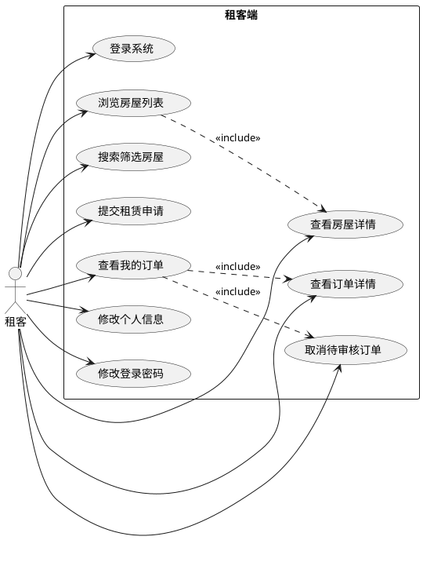
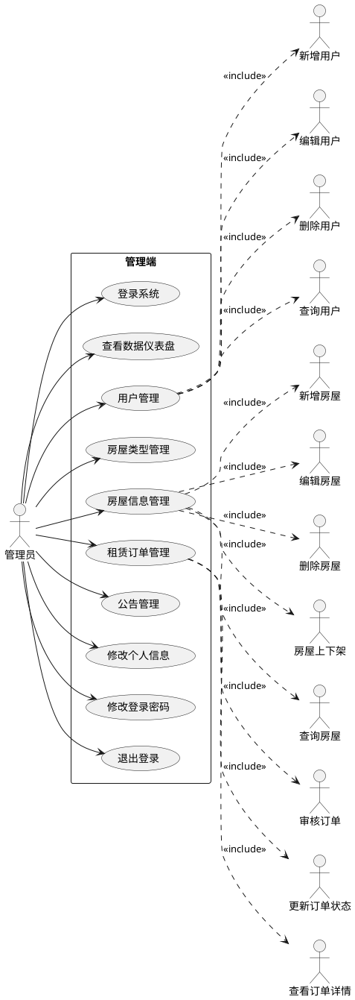
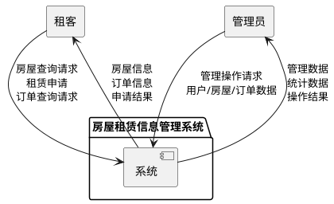
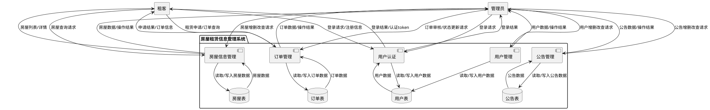
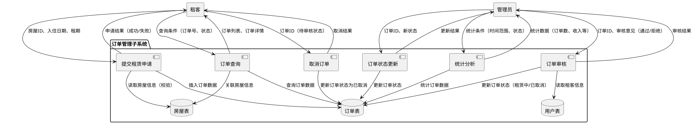

# 第3章 系统分析

## 3.1 功能需求分析

房屋租赁信息管理系统主要面向租客和管理员两类用户，系统分为租客端和管理端两大部分。租客端为租客提供房屋浏览、搜索筛选、申请租赁、订单管理等服务；管理端为管理员提供用户管理、房屋管理、订单管理、公告管理等功能。详细功能描述如下：

### 3.1.1 系统租客端功能

租客端是面向普通租客用户的功能模块，租客需要注册登录后才能使用完整功能。租客端的主要功能包括房屋浏览模块、搜索筛选模块、房屋详情模块、申请租赁模块、我的订单模块和个人中心模块。详细功能描述如下：

**（1）房屋浏览模块**：租客登录后进入首页，首页以卡片式布局展示所有上架的房屋信息，每张房屋卡片展示房屋的主图、月租金价格标签、房屋标题、户型、面积、所在区域、详细地址、房屋类型标签等信息。页面底部提供分页功能，租客可以翻页浏览更多房源。

**（2）搜索筛选模块**：租客可以通过多种方式筛选和查找房屋。支持按照关键词进行模糊搜索（搜索标题、地址等），支持按照房屋类型（如一居室、两居室、三居室等）进行分类筛选，支持按照价格区间（最低价格和最高价格）进行筛选，多种筛选条件可以组合使用，帮助租客快速找到符合需求的房源。

**（3）房屋详情模块**：租客点击房屋卡片可以查看房屋的详细信息，详情页面以轮播图形式展示房屋的多张图片，展示房屋的标题、月租金、押金、户型、面积、楼层、朝向、装修情况、房屋类型、详细地址、房屋描述等完整信息，方便租客全面了解房屋情况。

**（4）申请租赁模块**：租客在浏览房屋时，如果对某套房屋感兴趣，可以点击"申请租赁"按钮提交租赁申请。申请时需要选择入住日期（不能早于当天）、选择租期（以月为单位）、填写备注信息（选填）。提交申请后，订单状态为"待审核"，等待管理员审核。

**（5）我的订单模块**：租客可以查看自己提交的所有租赁订单，订单列表展示订单编号、房屋信息、月租金、入住日期、结束日期、租期、订单状态、申请时间等信息。支持按照订单号搜索和按照订单状态筛选。订单状态分为待审核、租赁中、已到期、已取消四种。对于待审核状态的订单，租客可以主动取消申请。租客也可以查看订单的详细信息。

**（6）个人中心模块**：租客可以查看和修改自己的个人信息，包括昵称、邮箱、手机号、头像等，也可以修改登录密码。

### 3.1.2 系统管理端功能

管理端是面向系统管理员的功能模块，管理员拥有系统的全部管理权限。管理员账号在数据库中预设，无需注册，直接通过后台登录页面登录即可使用。后台管理主要分为仪表盘、用户管理、房屋类型管理、房屋信息管理、租赁订单管理、公告管理和个人中心模块[5]。

详细的功能描述如下：

**（1）仪表盘模块**：管理员登录后首先进入数据仪表盘页面，仪表盘以卡片和图表的形式展示系统的整体运行数据，包括用户总数、房屋总数、订单总数、在租订单数、租赁收入等统计数据，以及订单趋势图、房屋类型分布图等可视化图表，帮助管理员快速了解系统运营情况。

**（2）用户管理模块**：该模块对系统所有用户进行管理，包括管理员和租客。管理员可以查看用户列表，支持按用户名、昵称、状态等条件搜索用户，可以新增用户、编辑用户信息、删除用户、启用/禁用用户账号，还可以重置用户的登录密码。

**（3）房屋类型管理模块**：房屋类型是房屋的分类字典数据，管理员可以对房屋类型进行管理，包括新增房屋类型、编辑房屋类型名称和描述、删除房屋类型、调整类型排序等操作。

**（4）房屋信息管理模块**：房屋信息管理是后台的核心功能，管理员可以对所有房屋信息进行维护。功能包括新增房屋（填写房屋标题、类型、面积、户型、租金、押金、地址、楼层、朝向、装修、描述、上传图片等）、编辑房屋信息、删除房屋、上下架管理（切换房屋的上架和下架状态）、按条件搜索查询房屋等。

**（5）租赁订单管理模块**：管理员可以查看所有租客的租赁订单，支持按订单号、租客姓名、订单状态、时间范围等条件筛选查询。可以查看订单详情，对待审核的订单进行审核操作（审核通过或拒绝），可以手动更新订单状态（如标记为已到期），也可以删除订单记录。

**（6）公告管理模块**：管理员可以发布和管理系统公告，包括新增公告、编辑公告内容、删除公告、发布/下架公告等操作。公告分为通知、公告、活动三种类型。

**（7）个人中心模块**：管理员可以修改自己的个人信息和登录密码。

## 3.2 角色用例分析

房屋租赁信息管理系统一共有两个角色，分别是租客和管理员。租客需要注册并登录后才能使用系统的完整功能，管理员通过后台登录页面登录后使用管理功能。下面分别对租客和管理员进行业务用例分析。

如图3-1所示，租客需要先注册账号并登录系统，登录后可以浏览房屋列表，可以按照关键词、类型、价格区间等条件筛选搜索房屋，可以查看房屋详情，可以提交租赁申请，可以查看我的订单列表和详情，可以取消待审核的订单，还可以修改个人信息和密码。

图3-1 租客用例图

**租客用例图PlantUML代码：**

如图3-2所示，管理员只有在后台系统输入的账号和密码都正确的情况下，才可以进入后台管理主页。管理员登录后可以查看数据仪表盘，可以进行用户管理（增删改查）、房屋类型管理（增删改查）、房屋信息管理（增删改查、上下架）、租赁订单管理（查看、审核、状态更新、删除）、公告管理（增删改查、发布下架），还可以修改个人信息和密码，也可以退出登录。

图3-2 管理员用例图

**管理员用例图PlantUML代码：**

## 3.3 系统数据流分析

数据流图通常被称为DFD图，主要作用是对本次系统的逻辑模型进行描述，是一种图示工具，因此，用图示的方法能够清晰的描述系统中数据的流动情况和加工的过程。

**（1）经过分析系统的外部实体是租客和管理员**，外部实体需要和系统进行数据交互，因此顶层数据流图如图3-3所示：

图3-3 顶层数据流图

**顶层数据流图PlantUML代码：**

**（2）以顶层数据流图基础，得出目标系统和实体间的数据流情况，把处理的过程看做是一个加工的过程，先申请加工，加工完了就返回，因此得出第一层数据流图如图3-4所示：**

图3-4 第一层数据流图

**第一层数据流图PlantUML代码：**

**（3）再对管理员的管理信息的数据流程继续的细化一下，因此能够得到目标系统的第二层数据流图（以订单管理为例），如图3-5所示：**

图3-5 第二层数据流图（订单管理细化）

**第二层数据流图PlantUML代码：**

