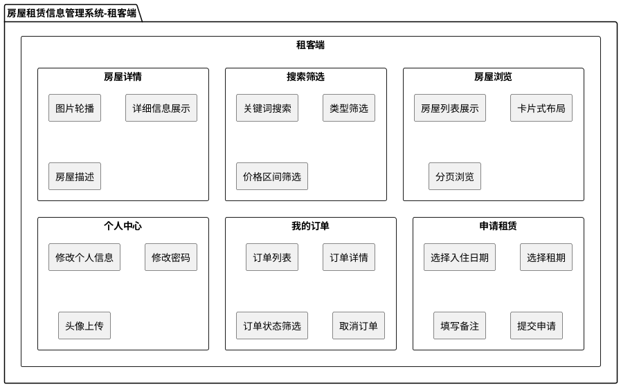
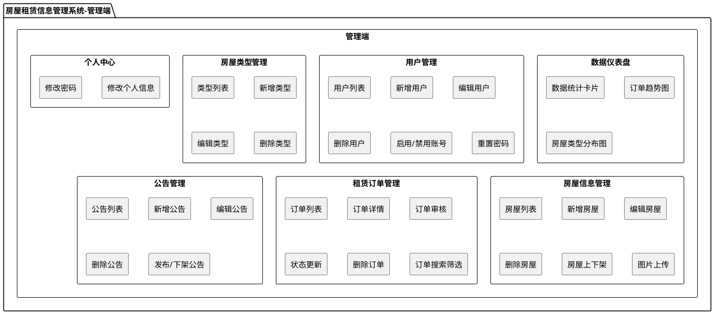
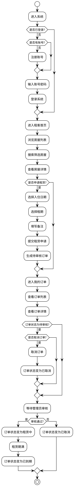
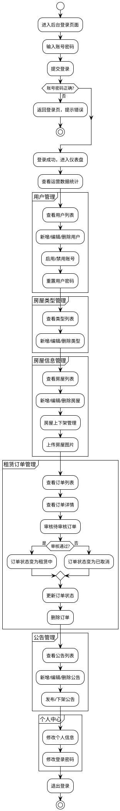
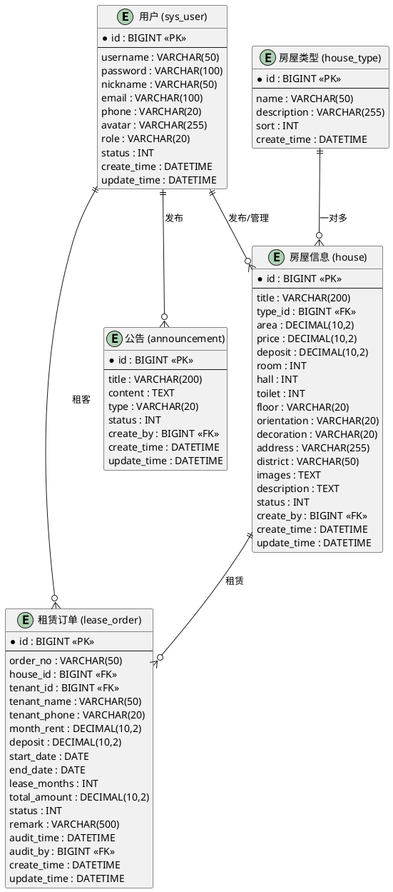

# 第4章 系统总体设计

## 4.1 系统功能结构

功能模块图表示目标系统应该要实现的各类功能，并将它们分类，总结。之后的设计与实现需要根据功能模块图来实现这些具体功能[5]。

房屋租赁信息管理系统分为租客端和管理端两大部分。租客端面向普通租客用户，提供房屋浏览、搜索筛选、申请租赁、订单管理、个人中心等功能；管理端面向系统管理员，提供仪表盘、用户管理、房屋管理、订单管理、公告管理、个人中心等功能。经分析系统租客端功能模块如图4-1所示：

图4-1 系统租客端功能结构图

**租客端功能结构图PlantUML代码：**

系统管理端功能模块如图4-2所示：

图4-2 系统管理端功能结构图

**管理端功能结构图PlantUML代码：**

## 4.2 系统业务流程

经分析系统的租客端业务流程如图4-3所示：

租客进入系统后，首先需要登录账号。如果没有账号，可以先注册。登录成功后进入租客端首页，可以浏览房屋列表，使用搜索筛选功能查找合适的房屋。找到心仪的房屋后，可以查看房屋详情，了解房屋的具体信息。如果决定租赁，点击"申请租赁"按钮，填写入住日期、租期等信息后提交租赁申请。提交后订单状态为"待审核"，等待管理员审核。租客可以在"我的订单"中查看自己的订单状态和详情。如果订单还在待审核状态，租客也可以主动取消订单。管理员审核通过后，订单状态变为"租赁中"，租赁期满后订单状态变为"已到期"。

图4-3 系统租客端业务流程图

**租客端业务流程图PlantUML代码：**

管理端的业务流程如图4-4所示：

管理员通过后台登录页面输入账号密码登录系统，系统验证账号密码的正确性。验证通过后进入管理端仪表盘首页，查看系统的整体运营数据统计。管理员可以根据需要进入各个管理模块进行操作：用户管理模块可以对用户进行增删改查和账号状态管理；房屋类型管理模块可以维护房屋的分类字典；房屋信息管理模块可以新增、编辑、删除房屋信息，管理房屋上下架状态，上传房屋图片；租赁订单管理模块可以查看所有订单，对待审核的订单进行审核（通过或拒绝），更新订单状态，删除订单记录；公告管理模块可以发布和管理系统公告。管理员也可以在个人中心修改自己的信息和密码。完成操作后，管理员可以退出登录。

图4-4 系统管理端业务流程图

**管理端业务流程图PlantUML代码：**

## 4.3 数据库设计

### 4.3.1 概念模型设计

经过分析本系统的实体E-R图，如图4-5所示：

系统的主要实体包括：用户（SysUser）、房屋类型（HouseType）、房屋信息（House）、租赁订单（LeaseOrder）、公告（Announcement）。

各实体之间的关系如下：
- 用户与房屋：管理员可以发布和管理多个房屋，一对多关系。
- 房屋类型与房屋：一种房屋类型对应多套房屋，一对多关系。
- 用户与租赁订单：一个租客可以有多个租赁订单，一对多关系；一套房屋可以有多个租赁订单（不同时期），一对多关系。
- 用户与公告：管理员可以发布多个公告，一对多关系。

图4-5 系统E-R模型图

**E-R模型图PlantUML代码：**

